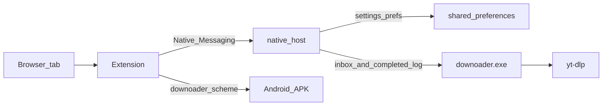

# Downloader

Flutter app (Windows + Android) to download video/audio via yt-dlp, plus a browser extension (Chrome, Edge, Firefox desktop, Firefox Android) that sends links and settings to the local app — no web server.

## License / what you may do

See [`LICENSE`](LICENSE). Short version:

- **You may** use the app for free (personal / internal use) and view the source on GitHub.
- **You may not** sell the app or redistribute modified builds as your own product.
- **Code changes** (public forks / shared patches) only **in consultation with** the author — open a discussion/PR or ask first.
- The software is provided **as is**, without warranty.
- Bundled tools (yt-dlp, ffmpeg, …) keep **their own** licenses.

## Windows use

1. Go to [Releases](https://github.com/redubbledd1-ops/Downloader/releases)
2. Download `DownloaderSetup-1.0.0.exe` (or the latest Setup)
3. Run the installer (default folder: `C:\Program Files (x86)\DownloaderD` — app, tools, host, and extension all live there; optional Chrome/Edge extension setup)

During setup you choose a **download folder**, and you can enable **Chrome** and/or **Edge**. The installer prepares the extension files, registers native messaging, and opens the extensions page so you can **Load unpacked** once.

Windows may show a SmartScreen ("Windows protected your PC") warning because the installer is not yet Authenticode-signed. Click **More info** → **Run anyway**. A paid code-signing certificate is required to remove that warning for good.

## Android use

1. Go to [Releases](https://github.com/redubbledd1-ops/Downloader/releases)
2. Download `Downloader-1.0.0.apk` — this is the **Android phone/tablet app** (not a browser extension)
3. Open the file on your device → allow install from unknown sources if asked → install

The Chrome/Edge/Firefox extension talks to the Windows app via native messaging. On Android, the Firefox extension opens the APK app (`downoader://download?url=…`). You can also share a link to the Downloader app.

### Publishing a release (maintainers)

Built files land in `dist\` locally; they are not uploaded to GitHub automatically.

```powershell
# Windows Setup
powershell -ExecutionPolicy Bypass -File scripts\build-windows-installer.ps1

# Android APK
flutter build apk --release
Copy-Item -Force build\app\outputs\flutter-apk\app-release.apk dist\Downloader-1.0.0.apk

# Create a new release (one line — works in cmd and PowerShell)
gh release create v1.0.0 "dist\DownloaderSetup-1.0.0.exe" "dist\Downloader-1.0.0.apk" --title "Downloader 1.0.0" --notes "Windows installer + Android APK"

# Or add files to an existing release
gh release upload v1.0.0 "dist\Downloader-1.0.0.apk" --clobber
```

Release page: `https://github.com/redubbledd1-ops/Downloader/releases/tag/v1.0.0`

## Developers — build the Windows installer

```powershell
powershell -ExecutionPolicy Bypass -File scripts\build-windows-installer.ps1
```

This will:

1. `flutter build windows --release`
2. Download yt-dlp / ffmpeg / deno into `build\...\Release\tools\`
3. Compile the native host into `Release\host\`
4. Build Setup.exe with Inno Setup → `dist\DownloaderSetup-1.0.0.exe`

Requires Flutter SDK + Dart SDK. Inno Setup 6+ is installed via winget if missing.

## Developers — run without the installer

```bash
flutter pub get
flutter run -d windows
# or
flutter run -d <android-device>
```

Without a bundled `tools\` folder, the app downloads yt-dlp/ffmpeg/deno on first use into `%APPDATA%\com.example\Downloader\` (dev fallback). A legacy manual copy at `C:\Program Files\yt-dlpd.exe` still works.

On Windows startup the app stores its own path (`flutter.app_exe`) so the extension can launch it.

## Browser extension → app

Chrome, Edge and Firefox (desktop + Android) all load the **same** [`extension`](extension) folder.



- **Settings** in the popup = global app settings (download folder, format, playlist mode). Changes save immediately (no Save button). Source: `%APPDATA%\com.example\Downloader\shared_preferences.json` (same as the exe). Video quality is hidden when the format is MP3.
- **Send to app** (Windows) puts the tab URL in an inbox; a running app picks it up and starts the download. If the app is not running, `downoader.exe` is started.
- **Download here** (Windows) runs yt-dlp via the native host. Finished files are written to the same download list as the exe (live if the app is open, otherwise on next launch).
- **Firefox Android**: native messaging does not exist; **Naar App** opens the Downloader APK with the current URL.

### 1. Load the extension (one folder)

**Chrome / Edge**

1. `chrome://extensions` or `edge://extensions`
2. Developer mode → **Load unpacked** → [`extension`](extension) folder

**Firefox desktop**

1. `about:debugging#/runtime/this-firefox`
2. **Load Temporary Add-on** → select [`extension/manifest.json`](extension/manifest.json)
3. Temporary add-ons are removed when Firefox restarts (Developer Edition can allow unsigned add-ons permanently)

**Firefox for Android**

1. Install the Downloader APK
2. From a desktop Firefox: `about:debugging` → connect the phone → **Load Temporary Add-on** with the same `extension` folder
3. Or zip the folder contents (manifest at the zip root) and install as a file on Firefox Nightly / via debugging

### 2. Register the native host (Windows desktop)

After an installer build the host is in `Release\host\` (or under Program Files after install). For development:

```powershell
cd native_host
dart pub get
dart compile exe bin/host.dart -o ..\extension\host\downoader_native_host.exe

powershell -ExecutionPolicy Bypass -File scripts\install-native-host.ps1
```

Optional: `-AppExe "C:\path\to\downoader.exe"` `-Browsers chrome|edge|firefox|both|all`

The host manifest allows both the Chrome/Edge extension ID and the Firefox ID `downloader@downoader.app`.

### 3. Usage

1. Reload the extension
2. Open a video tab → extension → adjust settings if needed (auto-saved) → **Send to app** / download

### Uninstall

```powershell
powershell -ExecutionPolicy Bypass -File scripts\uninstall-native-host.ps1
```

## Project layout

| Path | Role |
|------|------|
| `lib/` | Flutter UI + yt-dlp + inbox poller |
| `native_host/` | Native Messaging host (settings + sendToApp + download) |
| `extension/` | One MV3 folder for Chrome, Edge, Firefox desktop and Firefox Android |
| `scripts/` | Native host install/uninstall + Windows installer build |
| `installer/` | Inno Setup script |
| `dist/` | Generated Setup.exe / APK (not committed) |

## Notes

- No Flutter web target: the browser cannot run yt-dlp.
- After moving `downoader.exe` or changing the Chrome extension ID: re-run the install script.
- To update yt-dlp in an installed app: replace `{installDir}\tools\yt-dlp.exe`, or delete the APPDATA copy so the bundled one is used again.

