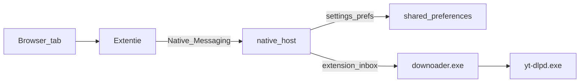

# Downloader

Flutter-app (Windows + Android) om video/audio te downloaden via yt-dlp, plus een Chrome/Edge-extentie die links en settings naar de Windows-app stuurt — zonder webserver.

## Vereisten

- [yt-dlpd.exe](https://github.com/yt-dlp/yt-dlp) op `C:\Program Files\yt-dlpd.exe` (Windows)
- ffmpeg op PATH, of laat de Windows-app een portable build ophalen
- Flutter SDK (desktop/Android-app)
- Dart SDK (zit bij Flutter; native messaging host compileren)

## Windows / Android-app

```bash
flutter pub get
flutter run -d windows
# of
flutter run -d <android-device>
```

Op Windows schrijft de app bij start haar eigen pad weg (`flutter.app_exe`), zodat de extentie de app kan openen.

## Browser-extentie → Windows-app



- **Settings** in de popup = globale app-settings (downloadmap, formaat, playlist-modus, dark mode). Bron: `%APPDATA%\com.example\Downloader\shared_preferences.json` (zelfde als de exe).
- **Naar app sturen** zet de tab-URL in een inbox; de draaiende app pikt die op en start de download. Draait de app niet, dan wordt `downoader.exe` gestart.
- **Direct downloaden** gebruikt yt-dlp via de native host met dezelfde settings (zonder app-UI).

### 1. Extentie laden

1. `chrome://extensions` of `edge://extensions`
2. Developer mode → **Load unpacked** → map [`extension`](extension)
3. Extension ID kopiëren

### 2. Native host registreren

```powershell
cd native_host
dart pub get
dart compile exe bin/host.dart -o ..\extension\host\downoader_native_host.exe

powershell -ExecutionPolicy Bypass -File scripts\install-native-host.ps1 -ExtensionId JOUW_EXTENSION_ID
```

Optioneel: `-AppExe "C:\pad\naar\downoader.exe"` `-Browsers chrome|edge|both`

### 3. Gebruik

1. Open de Windows-app minstens één keer
2. Herlaad de extentie
3. Open een video-tab → extentie → eventueel settings aanpassen → **Naar app sturen & downloaden**

### Verwijderen

```powershell
powershell -ExecutionPolicy Bypass -File scripts\uninstall-native-host.ps1
```

## Projectstructuur

| Pad | Rol |
|-----|-----|
| `lib/` | Flutter UI + yt-dlp + inbox-poller |
| `native_host/` | Native Messaging host (settings + sendToApp + download) |
| `extension/` | MV3 Chrome/Edge-extentie |
| `scripts/` | Install/uninstall native host |

## Notities

- Geen Flutter-web target: browser kan yt-dlp niet draaien.
- Android ongewijzigd (geen extentie).
- Na verplaatsen van `downoader.exe` of nieuwe Extension ID: install-script opnieuw draaien.
