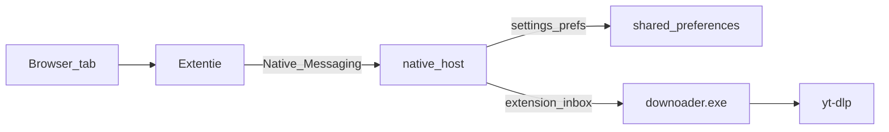

# Downloader

Flutter-app (Windows + Android) om video/audio te downloaden via yt-dlp, plus een Chrome/Edge-extentie die links en settings naar de Windows-app stuurt — zonder webserver.

## Eindgebruikers (Windows)

1. Ga naar [Releases](https://github.com/redubbledd1-ops/Downloader/releases)
2. Download `DownloaderSetup-1.0.0.exe` (of de nieuwste Setup)
3. Run de installer → klaar (app + tools + optioneel Chrome/Edge-extentie)

Tijdens setup kun je **Chrome** en/of **Edge** aanvinken. De installer zet de extentie klaar, registreert native messaging, en opent de extentiepagina zodat je eenmalig **Load unpacked** kiest.

## Eindgebruikers (Android)

1. Ga naar [Releases](https://github.com/redubbledd1-ops/Downloader/releases)
2. Download `Downloader-1.0.0.apk`
3. Open het bestand op je telefoon → toestaan “installeren uit onbekende bronnen” indien gevraagd → installeren

De APK is een release-build (sideload). De Chrome/Edge-extentie werkt alleen op Windows, niet op Android.

### Release publiceren (voor jou als maintainer)

De Setup.exe / APK staan lokaal in `dist\` na een build, maar komen niet automatisch op GitHub. Publiceren:

```powershell
# Windows Setup
powershell -ExecutionPolicy Bypass -File scripts\build-windows-installer.ps1

# Android APK
flutter build apk --release
Copy-Item -Force build\app\outputs\flutter-apk\app-release.apk dist\Downloader-1.0.0.apk

# Nieuwe release (één regel, werkt in cmd én PowerShell)
gh release create v1.0.0 "dist\DownloaderSetup-1.0.0.exe" "dist\Downloader-1.0.0.apk" --title "Downloader 1.0.0" --notes "Windows-installer + Android APK"

# Of bestanden toevoegen aan een bestaande release
gh release upload v1.0.0 "dist\Downloader-1.0.0.apk" --clobber
```

Daarna staan de bestanden op: `https://github.com/redubbledd1-ops/Downloader/releases/tag/v1.0.0`

## Ontwikkelaars — Windows-installer bouwen

```powershell
powershell -ExecutionPolicy Bypass -File scripts\build-windows-installer.ps1
```

Dit doet achtereenvolgens:

1. `flutter build windows --release`
2. yt-dlp / ffmpeg / deno downloaden naar `build\...\Release\tools\`
3. Native host compileren naar `Release\host\`
4. Setup.exe maken met Inno Setup → `dist\DownloaderSetup-1.0.0.exe`

Vereisten voor dit build-script: Flutter SDK + Dart SDK. Inno Setup 6+ wordt via winget geinstalleerd als die ontbreekt.

## Ontwikkelaars — app draaien zonder installer

```bash
flutter pub get
flutter run -d windows
# of
flutter run -d <android-device>
```

Zonder gebundelde `tools\`-map downloadt de app yt-dlp/ffmpeg/deno bij eerste gebruik naar `%APPDATA%\com.example\Downloader\` (dev-fallback). Een oude handmatige kopie op `C:\Program Files\yt-dlpd.exe` blijft ook werken.

Op Windows schrijft de app bij start haar eigen pad weg (`flutter.app_exe`), zodat de extentie de app kan openen.

## Browser-extentie → Windows-app



- **Settings** in de popup = globale app-settings (downloadmap, formaat, playlist-modus, dark mode). Bron: `%APPDATA%\com.example\Downloader\shared_preferences.json` (zelfde als de exe).
- **Naar app sturen** zet de tab-URL in een inbox; de draaiende app pikt die op en start de download. Draait de app niet, dan wordt `downoader.exe` gestart.
- **Direct downloaden** gebruikt yt-dlp via de native host met dezelfde settings (zonder app-UI).

### 1. Extentie laden

1. `chrome://extensions` of `edge://extensions`
2. Developer mode → **Load unpacked** → map [`extension`](extension)
3. Extension ID kopiëren

### 2. Native host registreren

Na een installer-build staat de host al in `Release\host\` (of onder Program Files na installatie). Voor development:

```powershell
cd native_host
dart pub get
dart compile exe bin/host.dart -o ..\extension\host\downoader_native_host.exe

powershell -ExecutionPolicy Bypass -File scripts\install-native-host.ps1 -ExtensionId JOUW_EXTENSION_ID
```

Optioneel: `-AppExe "C:\pad\naar\downoader.exe"` `-Browsers chrome|edge|both`

### 3. Gebruik

1. Herlaad de extentie
2. Open een video-tab → extentie → eventueel settings aanpassen → **Naar app sturen & downloaden**

### Verwijderen

```powershell
powershell -ExecutionPolicy Bypass -File scripts\uninstall-native-host.ps1
```

## Projectstructuur

| Pad | Rol |
|-----|-----|
| `lib/` | Flutter UI + yt-dlp + inbox-poller |
| `native_host/` | Native Messaging host (settings + sendToApp + download) |
| `extension/` | MV3 Chrome/Edge-extentie |
| `scripts/` | Install/uninstall native host + Windows installer build |
| `installer/` | Inno Setup-script |
| `dist/` | Gegenereerde Setup.exe |

## Notities

- Geen Flutter-web target: browser kan yt-dlp niet draaien.
- Android ongewijzigd (geen extentie).
- Na verplaatsen van `downoader.exe` of nieuwe Extension ID: install-script opnieuw draaien.
- yt-dlp in een geinstalleerde app: vervang `{installDir}\tools\yt-dlp.exe`, of verwijder de APPDATA-kopie zodat de gebundelde versie weer wint.
